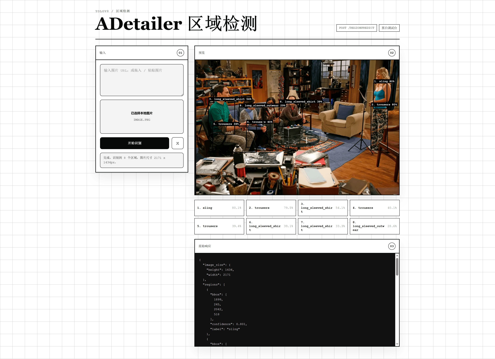

# ADetailer Region Predict

基于 YOLOv8 的图像区域检测服务，支持服装、人脸、手部、人体等目标的边界框识别。

## 项目结构

```
.
├── app.py                          # Flask 服务入口
├── requirements.txt
├── Dockerfile
├── templates/
│   └── debug.html                  # 可视化调试页面
└── adetailer/
    └── deepfashion2_yolov8s-seg.pt # 模型文件
```

## 接口说明

### POST /regionPredict

**请求体：**

支持通过图片 URL 识别：

```json
{ "image_url": "https://example.com/image.jpg" }
```

兼容旧字段名：

```json
{ "imageurl": "https://example.com/image.jpg" }
```

也支持 base64 图片，既可以传纯 base64，也可以传 Data URL：

```json
{ "image_base64": "data:image/png;base64,iVBORw0KGgo..." }
```

`image_url` / `imageurl` 与 `image_base64` 不能同时传入。

**返回：**

```json
{
  "regions": [
    { "bbox": [x1, y1, x2, y2], "label": "trousers", "confidence": 0.91 }
  ],
  "image_size": { "width": 640, "height": 480 }
}
```

`bbox` 中 `(x1, y1)` 为左上角坐标，`(x2, y2)` 为右下角坐标。

### GET /

可视化调试页面，支持输入图片 URL、拖入图片文件、粘贴剪贴板图片，并自动框选识别结果。



---

## 本地运行

**1. 安装依赖**

建议使用 Python 3.10+，按以下顺序安装，避免 pip 自动拉取带 CUDA/cuDNN 的 torch。
本地 ultralytics 版本建议和 Docker 基础镜像保持一致：

```bash
# 先装 CPU 版 torch（需固定版本，torch 2.6+ 与 ultralytics 8.2.0 不兼容）
pip install "torch==2.3.1" "torchvision==0.18.1" --index-url https://download.pytorch.org/whl/cpu

# 再装 ultralytics（检测到 torch 已存在，不会重新下载 CUDA 版）
pip install ultralytics==8.3.96

# 最后装应用依赖
pip install -r requirements.txt
```

**2. 启动服务**

```bash
python app.py
```

服务默认监听 `http://localhost:9000`，启动日志：

```
Loading model from: adetailer/deepfashion2_yolov8s-seg.pt
Model loaded.
```

**3. 环境变量配置**

| 变量名 | 默认值 | 说明 |
|--------|--------|------|
| `PORT` | `9000` | 服务监听端口 |
| `MODEL_PATH` | `adetailer/deepfashion2_yolov8s-seg.pt` | YOLO 模型文件路径 |
| `MAX_IMAGE_SIZE_MB` | `10` | 远程图片最大下载大小，单位 MB |

示例：

```bash
PORT=9100 MAX_IMAGE_SIZE_MB=5 python app.py
```

**4. 访问调试页面**

打开浏览器访问 `http://localhost:9000`，输入图片 URL、拖入图片文件或直接粘贴图片后点击“开始识别”，也可以在 URL 输入框内按 `Ctrl+Enter` / `Cmd+Enter` 识别。

**5. 测试接口**

```bash
curl -X POST http://localhost:9000/regionPredict \
  -H "Content-Type: application/json" \
  -d '{"image_url": "https://example.com/fashion.jpg"}'
```

base64 图片示例：

```bash
curl -X POST http://localhost:9000/regionPredict \
  -H "Content-Type: application/json" \
  -d '{"image_base64": "data:image/png;base64,iVBORw0KGgo..."}'
```

**切换模型（可选）**

通过环境变量指定其他模型路径：

```bash
MODEL_PATH=adetailer/face_yolov8n.pt python app.py
```

---

## Docker 运行

基础镜像使用 Ultralytics 官方镜像 `ultralytics/ultralytics:8.3.96-cpu`，torch + ultralytics 已内置，无需单独安装。

**1. 构建镜像**

```bash
docker build -t adetailer:latest .
```

> 首次构建需要拉取基础镜像（约 2GB），之后增量构建很快。

**2. 启动容器**

```bash
docker run -p 9000:9000 adetailer:latest
```

使用环境变量调整端口和图片大小限制：

```bash
docker run -p 9100:9100 \
  -e PORT=9100 \
  -e MAX_IMAGE_SIZE_MB=5 \
  adetailer:latest
```

挂载本地模型目录（避免重复打包模型文件）：

```bash
docker run -p 9000:9000 \
  -v $(pwd)/adetailer:/app/adetailer \
  adetailer:latest
```

**3. 访问服务**

同本地运行，访问 `http://localhost:9000`。

---

## 部署到阿里云 FC

**1. 推送镜像到 ACR**

```bash
docker tag adetailer:latest registry.cn-hangzhou.aliyuncs.com/<namespace>/adetailer:latest
docker push registry.cn-hangzhou.aliyuncs.com/<namespace>/adetailer:latest
```

**2. FC 函数配置**

| 配置项 | 推荐值 |
|--------|--------|
| 运行时 | 自定义容器 |
| 监听端口 | 9000 |
| 内存 | 1024 MB 以上 |
| 超时时间 | 60s |
| 触发器 | HTTP 触发器 |

> 建议开启**预留实例**，避免冷启动时重复加载模型（首次加载约 3~5 秒）。

---

## 可用模型

从 [Bingsu/adetailer](https://huggingface.co/Bingsu/adetailer) 下载所需模型放入 `adetailer/` 目录：

| 模型文件 | 识别目标 | mAP50 |
|----------|----------|-------|
| `face_yolov8n.pt` | 人脸（2D/写实） | 0.660 |
| `face_yolov8s.pt` | 人脸（2D/写实） | 0.713 |
| `hand_yolov8n.pt` | 手部 | 0.767 |
| `person_yolov8n-seg.pt` | 人体分割 | 0.782 |
| `deepfashion2_yolov8s-seg.pt` | 服装（13类） | 0.849 |

---

## 来源标记

Docker 封装：<https://github.com/Ericwyn/adetailer>

模型数据：

- <https://huggingface.co/Bingsu/adetailer>
- <https://github.com/switchablenorms/DeepFashion2/>
